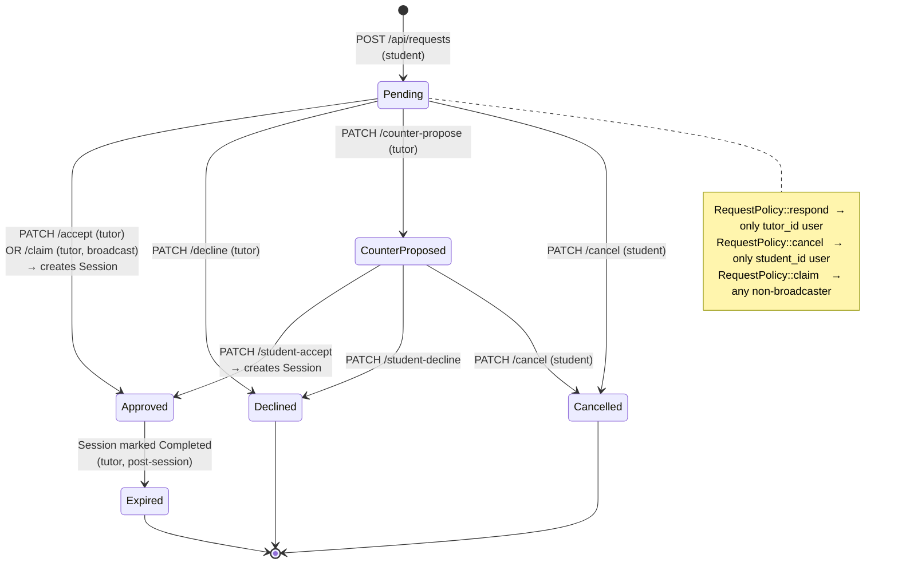
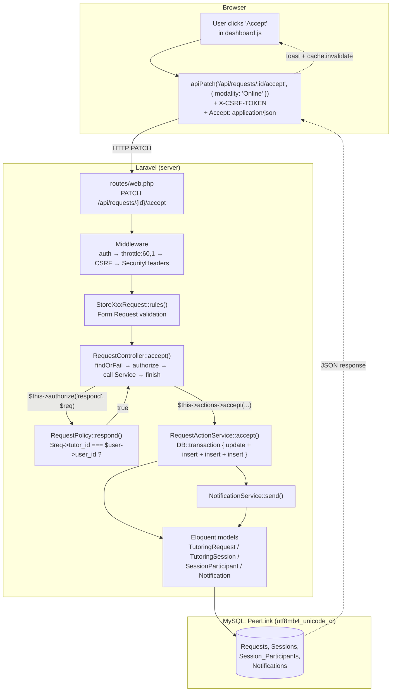

# PeerLink — Step-by-Step Build Tutorial

A code-along guide that takes you from `composer create-project` to a working PeerLink clone. Each step ends with code you can run + a "verify by" check.

You will build, in order:

1. A fresh Laravel + Breeze (Blade) install
2. A custom `Users` table (UUID PK, `password_hash` column) — overriding Laravel's defaults
3. The PeerLink domain schema (Programs, Courses, Tutor_Profiles, Requests, Sessions, …)
4. Eloquent models with relationships
5. PHP enums for status fields
6. A dashboard page that lists tutors
7. A "Request a session" form that writes to the DB
8. The tutor's "Accept / Decline" flow with Policies and a Service layer
9. A My-Sessions list
10. Production build + deploy checklist

Skip nothing — each phase builds on the previous. **All code matches the existing repo's naming conventions** (PascalCase tables, UUID PKs, `password_hash`, etc.) so you can compare your work to the real files at any point.

---

## System overview

Three diagrams to keep in mind while you build. They render natively on GitHub.

### A. Database schema (ER)

Every table you'll create in Phase 1–2 and how they connect:

```mermaid
erDiagram
    Divisions          ||--o{ Programs              : "has"
    Divisions          ||--o{ Courses               : "owns"
    Programs           ||--o{ Users                 : "enrolls"
    Courses            ||--o{ Course_Topics         : "contains"
    Users              ||--o| Tutor_Profiles        : "is a tutor"
    Tutor_Profiles     }o--o{ Courses               : "Tutor_Expertise"
    Users              }o--o{ Courses               : "Tutee_Courses"
    Users              ||--o{ Requests              : "sends as student"
    Users              }o--o{ Requests              : "receives as tutor"
    Courses            ||--o{ Requests              : "for"
    Rooms              ||--o{ Requests              : "counter-proposed in"
    Requests           ||--|| Sessions              : "spawns"
    Sessions           }o--|| Rooms                 : "in"
    Sessions           ||--o{ Session_Participants  : "has"
    Users              ||--o{ Session_Participants  : "joins"
    Sessions           ||--o{ Session_Reviews       : "reviewed in"
    Users              ||--o{ Session_Reviews       : "writes / receives"
    Users              ||--o{ Notifications         : "receives"
    Users              ||--o| User_Photos           : "has"

    Users {
        char user_id PK "UUID"
        string email UK
        string password_hash
        string first_name
        string last_name
        string program_code FK
        int    current_year_level
    }
    Tutor_Profiles {
        char    user_id PK_FK
        text    bio
        decimal rating_avg
    }
    Requests {
        char request_id PK "UUID"
        char student_id FK
        char tutor_id   FK "nullable = broadcast"
        int  course_id  FK
        text message
        enum status "Pending|Approved|Declined|Expired|CounterProposed|Cancelled"
        timestamp counter_proposed_time
    }
    Sessions {
        char     session_id PK "UUID"
        char     request_id FK UK
        enum     modality "In-Person|Online"
        int      room_id FK
        datetime scheduled_time
        enum     status "Scheduled|Completed|Cancelled"
        text     summary
    }
    Session_Participants {
        char participation_id PK "UUID"
        char session_id FK
        char user_id    FK
        enum role "Tutor|Tutee"
        bool has_attended
    }
```

### B. Request lifecycle (state machine)

The 6 states a `Requests` row can be in, and the 7 actions that transition between them — what you'll wire up in Phase 7–8:



### C. How a request flows through the code

The architectural layers — what you'll assemble in Phase 5–8 (front to back):



If a layer rejects the request:
- **Mw** rejects unauthenticated → 401/302
- **FormReq** rejects bad input → 422 with field errors
- **Policy** returns false → 403
- **Service** returns `[false, "..."]` → 422 with the message

---

## Phase 0 — Project setup

### 0.1 Requirements

| Tool | Version | Why |
|---|---|---|
| PHP | 8.4+ | Symfony's `Request::createFromGlobals()` calls `request_parse_body()` for PATCH bodies — added in 8.4. |
| Composer | 2.x | PHP package manager. |
| MySQL | 8.x or MariaDB 10.6+ | Schema uses `enum`, `longblob`, `current_timestamp()`. |
| Node | 20.x + npm 10.x | Vite. |

```bash
php -v        # PHP 8.4.x
composer -V
mysql --version
node -v
```

### 0.2 Create the project

```bash
composer create-project laravel/laravel peerlink
cd peerlink
```

### 0.3 Install Breeze with the Blade stack

```bash
composer require laravel/breeze --dev
php artisan breeze:install blade
npm install
npm run build
```

Breeze scaffolds:
- `resources/views/auth/{login,register,forgot-password,reset-password}.blade.php`
- `app/Http/Controllers/Auth/`
- `routes/auth.php`

### 0.4 Configure the database

```bash
cp .env.example .env
php artisan key:generate
```

In MySQL, create the database with utf8mb4 (anything else mangles non-ASCII):

```sql
CREATE DATABASE PeerLink CHARACTER SET utf8mb4 COLLATE utf8mb4_unicode_ci;
```

Edit `.env`:

```ini
APP_NAME=PeerLink
APP_URL=http://127.0.0.1:8000

DB_CONNECTION=mysql
DB_HOST=127.0.0.1
DB_PORT=3306
DB_DATABASE=PeerLink
DB_USERNAME=root
DB_PASSWORD=YourPasswordHere

SESSION_DRIVER=file
SESSION_ENCRYPT=true
SESSION_HTTP_ONLY=true
SESSION_SAME_SITE=lax
```

### 0.5 Boot it

```bash
php artisan migrate
php artisan serve
```

In a second terminal:

```bash
npm run dev
```

**Verify**: visit `http://127.0.0.1:8000` → Laravel welcome page. Visit `/register` → Breeze's registration form.

---

## Phase 1 — Custom UUID `Users` table

Laravel's default `users` table has a bigint `id` and a `password` column. PeerLink uses a UUID `user_id` and a `password_hash` column. We override both.

### 1.1 Replace the default users migration

Delete the bigint default:

```bash
rm database/migrations/0001_01_01_000000_create_users_table.php
```

Create a fresh one (the timestamp prefix matters — Laravel runs migrations alphabetically):

```bash
php artisan make:migration create_custom_users_table
```

Replace its contents with:

```php
<?php
// database/migrations/2026_01_01_000000_create_custom_users_table.php
declare(strict_types=1);

use Illuminate\Database\Migrations\Migration;
use Illuminate\Support\Facades\DB;
use Illuminate\Support\Facades\Schema;

return new class extends Migration
{
    public function up(): void
    {
        // Use raw SQL because Eloquent's schema builder doesn't easily express
        // `DEFAULT (uuid())` and we want utf8mb4 from the start.
        DB::statement("
            CREATE TABLE `Users` (
                `user_id`            char(36)     NOT NULL DEFAULT (uuid()),
                `email`              varchar(255) NOT NULL,
                `password_hash`      varchar(255) NOT NULL,
                `first_name`         varchar(100) NOT NULL,
                `middle_name`        varchar(100) DEFAULT NULL,
                `last_name`          varchar(100) NOT NULL,
                `contact_number`     varchar(15)  DEFAULT NULL,
                `current_year_level` int(11)      NOT NULL,
                `program_code`       varchar(15)  NOT NULL,
                `created_at`         timestamp    NULL DEFAULT current_timestamp(),
                PRIMARY KEY (`user_id`),
                UNIQUE KEY `email` (`email`)
            ) ENGINE=InnoDB DEFAULT CHARSET=utf8mb4 COLLATE=utf8mb4_unicode_ci
        ");

        // Laravel's auth scaffolding still expects these — keep the bigint
        // versions so `password_reset_tokens` and `sessions` work unchanged.
        Schema::create('password_reset_tokens', function ($table) {
            $table->string('email')->primary();
            $table->string('token');
            $table->timestamp('created_at')->nullable();
        });

        Schema::create('sessions', function ($table) {
            $table->string('id')->primary();
            $table->string('user_id', 36)->nullable()->index();
            $table->string('ip_address', 45)->nullable();
            $table->text('user_agent')->nullable();
            $table->longText('payload');
            $table->integer('last_activity')->index();
        });
    }

    public function down(): void
    {
        Schema::dropIfExists('sessions');
        Schema::dropIfExists('password_reset_tokens');
        Schema::dropIfExists('Users');
    }
};
```

### 1.2 Update the `User` model

```php
<?php
// app/Models/User.php
declare(strict_types=1);

namespace App\Models;

use Illuminate\Database\Eloquent\Factories\HasFactory;
use Illuminate\Foundation\Auth\User as Authenticatable;
use Illuminate\Notifications\Notifiable;
use Illuminate\Support\Str;

class User extends Authenticatable
{
    use HasFactory, Notifiable;

    protected $table      = 'Users';        // PascalCase!
    protected $primaryKey = 'user_id';
    public $incrementing  = false;
    protected $keyType    = 'string';
    public const UPDATED_AT = null;          // we only have created_at

    protected $fillable = [
        'email', 'password_hash',
        'first_name', 'middle_name', 'last_name',
        'contact_number', 'current_year_level', 'program_code',
    ];

    protected $hidden = ['password_hash'];

    /** Tell Laravel's Auth which column holds the hashed password. */
    public function getAuthPassword(): string
    {
        return $this->password_hash;
    }

    public function getAuthPasswordName(): string
    {
        return 'password_hash';
    }

    /** No remember-me column in our schema → return null. */
    public function getRememberTokenName(): ?string
    {
        return null;
    }

    /** Auto-generate a UUID on insert if one wasn't provided. */
    protected static function boot(): void
    {
        parent::boot();
        static::creating(function ($model): void {
            if (empty($model->user_id)) {
                $model->user_id = (string) Str::uuid();
            }
        });
    }
}
```

### 1.3 Patch Breeze's `RegisteredUserController`

Open `app/Http/Controllers/Auth/RegisteredUserController.php`. Replace the `store()` method:

```php
public function store(Request $request): RedirectResponse
{
    $request->validate([
        'first_name'         => ['required', 'string', 'max:100'],
        'last_name'          => ['required', 'string', 'max:100'],
        'email'              => ['required', 'string', 'lowercase', 'email', 'max:255', 'unique:Users,email'],
        'password'           => ['required', 'confirmed', Rules\Password::defaults()],
        'current_year_level' => ['required', 'integer', 'min:1', 'max:10'],
        'program_code'       => ['required', 'string', 'max:15'],
    ]);

    $user = User::create([
        'first_name'         => $request->first_name,
        'last_name'          => $request->last_name,
        'email'              => $request->email,
        'password_hash'      => Hash::make($request->password),  // ← not 'password'
        'current_year_level' => $request->current_year_level,
        'program_code'       => $request->program_code,
    ]);

    event(new Registered($user));
    Auth::login($user);

    return redirect(route('dashboard', absolute: false));
}
```

### 1.4 Update Breeze's register form

`resources/views/auth/register.blade.php` ships with `name`, `email`, `password`, `password_confirmation`. Add `first_name`, `last_name`, `current_year_level`, `program_code` fields. Quick add (inside `<form>` before the existing email field):

```blade
<div>
    <x-input-label for="first_name" :value="__('First name')" />
    <x-text-input id="first_name" name="first_name" type="text" required autofocus
                  :value="old('first_name')" class="mt-1 block w-full" />
    <x-input-error :messages="$errors->get('first_name')" class="mt-2" />
</div>
<div class="mt-4">
    <x-input-label for="last_name" :value="__('Last name')" />
    <x-text-input id="last_name" name="last_name" type="text" required
                  :value="old('last_name')" class="mt-1 block w-full" />
    <x-input-error :messages="$errors->get('last_name')" class="mt-2" />
</div>
<div class="mt-4">
    <x-input-label for="program_code" :value="__('Program')" />
    <x-text-input id="program_code" name="program_code" type="text" required
                  :value="old('program_code')" class="mt-1 block w-full" placeholder="e.g. BSCS" />
    <x-input-error :messages="$errors->get('program_code')" class="mt-2" />
</div>
<div class="mt-4">
    <x-input-label for="current_year_level" :value="__('Year level')" />
    <x-text-input id="current_year_level" name="current_year_level" type="number" min="1" max="10" required
                  :value="old('current_year_level')" class="mt-1 block w-full" />
    <x-input-error :messages="$errors->get('current_year_level')" class="mt-2" />
</div>
```

### 1.5 Run

```bash
php artisan migrate:fresh
```

**Verify**: register at `/register` with a real email + password. The `Users` table should have a row with a UUID `user_id` and a bcrypt `password_hash`.

```sql
SELECT user_id, email, LEFT(password_hash, 10) AS hash_prefix FROM Users;
```

---

## Phase 2 — Domain schema

We'll create the rest of the schema in **separate migrations** (one concern per file — the convention going forward):

```bash
php artisan make:migration create_divisions_and_programs_tables
php artisan make:migration create_courses_tables
php artisan make:migration create_rooms_table
php artisan make:migration create_tutor_profiles_tables
php artisan make:migration create_tutee_courses_table
php artisan make:migration create_requests_table
php artisan make:migration create_sessions_tables
php artisan make:migration create_notifications_table
```

Each migration file follows the same pattern. I'll show two — copy the structure for the rest.

### 2.1 Divisions + Programs

```php
// database/migrations/2026_01_01_000001_create_divisions_and_programs_tables.php
declare(strict_types=1);

use Illuminate\Database\Migrations\Migration;
use Illuminate\Database\Schema\Blueprint;
use Illuminate\Support\Facades\Schema;

return new class extends Migration {
    public function up(): void
    {
        Schema::create('Divisions', function (Blueprint $table): void {
            $table->string('division_id', 10)->primary();
            $table->text('division_name');
        });

        Schema::create('Programs', function (Blueprint $table): void {
            $table->string('program_code', 15)->primary();
            $table->string('division_id', 10)->nullable();
            $table->text('program_name');
            $table->foreign('division_id')->references('division_id')->on('Divisions');
        });
    }

    public function down(): void
    {
        Schema::dropIfExists('Programs');
        Schema::dropIfExists('Divisions');
    }
};
```

### 2.2 Courses + Course_Topics

```php
Schema::create('Courses', function (Blueprint $table): void {
    $table->integerIncrements('course_id');
    $table->string('division_id', 10)->nullable();
    $table->string('course_code', 20);
    $table->text('course_name');
    $table->foreign('division_id')->references('division_id')->on('Divisions');
});

Schema::create('Course_Topics', function (Blueprint $table): void {
    $table->integerIncrements('topic_id');
    $table->unsignedInteger('course_id');
    $table->text('topic_name');
    $table->foreign('course_id')->references('course_id')->on('Courses')->onDelete('cascade');
});
```

### 2.3 Rooms

```php
Schema::create('Rooms', function (Blueprint $table): void {
    $table->integerIncrements('room_id');
    $table->string('room_code', 20)->unique();
    $table->text('room_name');
    $table->enum('room_type', ['Physical', 'Virtual']);
    $table->integer('capacity');
});
```

### 2.4 Tutor_Profiles + Tutor_Expertise

```php
Schema::create('Tutor_Profiles', function (Blueprint $table): void {
    $table->char('user_id', 36)->primary();
    $table->text('bio')->nullable();
    $table->decimal('rating_avg', 3, 2)->default(0);
    $table->foreign('user_id')->references('user_id')->on('Users')->onDelete('cascade');
});

Schema::create('Tutor_Expertise', function (Blueprint $table): void {
    $table->char('user_id', 36);
    $table->unsignedInteger('course_id');
    $table->primary(['user_id', 'course_id']);
    $table->foreign('user_id')->references('user_id')->on('Tutor_Profiles')->onDelete('cascade');
    $table->foreign('course_id')->references('course_id')->on('Courses')->onDelete('cascade');
});
```

### 2.5 Tutee_Courses

```php
Schema::create('Tutee_Courses', function (Blueprint $table): void {
    $table->char('user_id', 36);
    $table->unsignedInteger('course_id');
    $table->primary(['user_id', 'course_id']);
    $table->foreign('user_id')->references('user_id')->on('Users')->onDelete('cascade');
    $table->foreign('course_id')->references('course_id')->on('Courses')->onDelete('cascade');
});
```

### 2.6 Requests

```php
Schema::create('Requests', function (Blueprint $table): void {
    $table->char('request_id', 36)->primary();
    $table->char('student_id', 36);
    $table->char('tutor_id', 36)->nullable();          // nullable = broadcast
    $table->unsignedInteger('course_id');
    $table->text('message')->nullable();
    $table->enum('status', ['Pending', 'Approved', 'Declined', 'Expired', 'CounterProposed', 'Cancelled'])
          ->default('Pending');
    $table->timestamp('counter_proposed_time')->nullable();
    $table->text('counter_proposed_message')->nullable();
    $table->enum('counter_proposed_modality', ['In-Person', 'Online'])->nullable();
    $table->unsignedInteger('counter_proposed_room_id')->nullable();
    $table->timestamp('created_at')->useCurrent();

    $table->foreign('student_id')->references('user_id')->on('Users');
    $table->foreign('tutor_id')->references('user_id')->on('Users');
    $table->foreign('course_id')->references('course_id')->on('Courses');
    $table->foreign('counter_proposed_room_id')->references('room_id')->on('Rooms');
});
```

### 2.7 Sessions + Session_Participants

```php
Schema::create('Sessions', function (Blueprint $table): void {
    $table->char('session_id', 36)->primary();
    $table->char('request_id', 36)->unique();
    $table->enum('modality', ['In-Person', 'Online']);
    $table->unsignedInteger('room_id');
    $table->text('meeting_link')->nullable();
    $table->datetime('scheduled_time');
    $table->enum('status', ['Scheduled', 'Completed', 'Cancelled'])->default('Scheduled');
    $table->text('summary')->nullable();
    $table->timestamp('created_at')->useCurrent();
    $table->foreign('request_id')->references('request_id')->on('Requests')->onDelete('cascade');
    $table->foreign('room_id')->references('room_id')->on('Rooms');
});

Schema::create('Session_Participants', function (Blueprint $table): void {
    $table->char('participation_id', 36)->primary();
    $table->char('session_id', 36);
    $table->char('user_id', 36);
    $table->enum('role', ['Tutor', 'Tutee']);
    $table->boolean('has_attended')->nullable();
    $table->timestamp('joined_at')->useCurrent();
    $table->foreign('session_id')->references('session_id')->on('Sessions')->onDelete('cascade');
    $table->foreign('user_id')->references('user_id')->on('Users');
});
```

### 2.8 Notifications

```php
Schema::create('Notifications', function (Blueprint $table): void {
    $table->char('notification_id', 36)->primary();
    $table->char('user_id', 36);
    $table->string('type', 50);
    $table->text('message');
    $table->char('request_id', 36)->nullable();
    $table->boolean('is_read')->default(false);
    $table->timestamp('created_at')->useCurrent();
    $table->foreign('user_id')->references('user_id')->on('Users');
});
```

### 2.9 Run

```bash
php artisan migrate:fresh
```

**Verify**: `SHOW TABLES IN PeerLink;` — you should see all of them, plus the Breeze defaults.

---

## Phase 3 — Models with relationships

### 3.1 Simple ones first

```php
<?php
// app/Models/Program.php
declare(strict_types=1);
namespace App\Models;
use Illuminate\Database\Eloquent\Model;

class Program extends Model
{
    protected $table      = 'Programs';
    protected $primaryKey = 'program_code';
    public $incrementing  = false;
    protected $keyType    = 'string';
    public $timestamps    = false;
}

// app/Models/Course.php
class Course extends Model
{
    protected $table      = 'Courses';
    protected $primaryKey = 'course_id';
    public $timestamps    = false;
    protected $fillable   = ['division_id', 'course_code', 'course_name'];

    public function topics(): \Illuminate\Database\Eloquent\Relations\HasMany
    {
        return $this->hasMany(CourseTopic::class, 'course_id', 'course_id');
    }
}

// app/Models/CourseTopic.php
class CourseTopic extends Model
{
    protected $table      = 'Course_Topics';
    protected $primaryKey = 'topic_id';
    public $timestamps    = false;
}

// app/Models/Room.php
class Room extends Model
{
    protected $table      = 'Rooms';
    protected $primaryKey = 'room_id';
    public $timestamps    = false;
    protected $fillable   = ['room_code', 'room_name', 'room_type', 'capacity'];
}
```

### 3.2 TutorProfile (with the BelongsToMany pivot)

```php
<?php
// app/Models/TutorProfile.php
declare(strict_types=1);
namespace App\Models;

use Illuminate\Database\Eloquent\Model;
use Illuminate\Database\Eloquent\Relations\BelongsTo;
use Illuminate\Database\Eloquent\Relations\BelongsToMany;

class TutorProfile extends Model
{
    protected $table      = 'Tutor_Profiles';
    protected $primaryKey = 'user_id';
    public $incrementing  = false;
    protected $keyType    = 'string';
    public $timestamps    = false;
    protected $fillable   = ['user_id', 'bio', 'rating_avg'];

    public function user(): BelongsTo
    {
        return $this->belongsTo(User::class, 'user_id', 'user_id');
    }

    public function courses(): BelongsToMany
    {
        // The pivot is Tutor_Expertise. Both FK and Local Key are user_id —
        // not Laravel's default "id", so we pass them explicitly.
        return $this->belongsToMany(Course::class, 'Tutor_Expertise', 'user_id', 'course_id');
    }
}
```

### 3.3 Add the inverse on `User`

Open `app/Models/User.php` and add:

```php
use Illuminate\Database\Eloquent\Relations\BelongsToMany;
use Illuminate\Database\Eloquent\Relations\HasOne;

public function tutorProfile(): HasOne
{
    return $this->hasOne(TutorProfile::class, 'user_id', 'user_id');
}

public function tuteeCourses(): BelongsToMany
{
    return $this->belongsToMany(Course::class, 'Tutee_Courses', 'user_id', 'course_id');
}
```

### 3.4 TutoringRequest, TutoringSession, SessionParticipant, Notification

```php
<?php
// app/Models/TutoringRequest.php — note class name vs. table name mismatch
declare(strict_types=1);
namespace App\Models;

use Illuminate\Database\Eloquent\Model;
use Illuminate\Database\Eloquent\Relations\BelongsTo;
use Illuminate\Database\Eloquent\Relations\HasOne;
use Illuminate\Support\Str;

class TutoringRequest extends Model
{
    protected $table      = 'Requests';
    protected $primaryKey = 'request_id';
    public $incrementing  = false;
    protected $keyType    = 'string';
    public const UPDATED_AT = null;

    protected $fillable = [
        'student_id', 'tutor_id', 'course_id', 'message', 'status',
        'counter_proposed_time', 'counter_proposed_message',
        'counter_proposed_modality', 'counter_proposed_room_id',
    ];

    protected static function boot(): void
    {
        parent::boot();
        static::creating(function ($model): void {
            if (empty($model->request_id)) {
                $model->request_id = (string) Str::uuid();
            }
        });
    }

    public function student(): BelongsTo
    {
        return $this->belongsTo(User::class, 'student_id', 'user_id');
    }

    public function tutor(): BelongsTo
    {
        return $this->belongsTo(User::class, 'tutor_id', 'user_id');
    }

    public function course(): BelongsTo
    {
        return $this->belongsTo(Course::class, 'course_id', 'course_id');
    }

    public function session(): HasOne
    {
        return $this->hasOne(TutoringSession::class, 'request_id', 'request_id');
    }
}
```

`TutoringSession`, `SessionParticipant`, `Notification` follow the same UUID-boot pattern. Skipping their full bodies here — copy the structure from the repo if you need exact code. Each has:

- `protected $table` set to its PascalCase name
- `protected $primaryKey` (UUID column name)
- `public $incrementing = false; protected $keyType = 'string';`
- A `boot()` that auto-generates the UUID
- `$fillable` matching its columns
- Relationship methods (`belongsTo`/`hasMany`/`hasOne`/`belongsToMany`)

---

## Phase 4 — Enums for status fields

PHP 8.1+ native enums replace magic strings.

```php
<?php
// app/Enums/RequestStatus.php
declare(strict_types=1);
namespace App\Enums;

enum RequestStatus: string
{
    case Pending         = 'Pending';
    case Approved        = 'Approved';
    case Declined        = 'Declined';
    case Expired         = 'Expired';
    case CounterProposed = 'CounterProposed';
    case Cancelled       = 'Cancelled';
}

// app/Enums/SessionStatus.php
enum SessionStatus: string
{
    case Scheduled = 'Scheduled';
    case Completed = 'Completed';
    case Cancelled = 'Cancelled';
}

// app/Enums/RequestAction.php  — values map to URL slugs (with `_` not `-`)
enum RequestAction: string
{
    case Accept          = 'accept';
    case Decline         = 'decline';
    case Claim           = 'claim';
    case CounterPropose  = 'counter_propose';
    case StudentAccept   = 'student_accept';
    case StudentDecline  = 'student_decline';
    case Cancel          = 'cancel';
}
```

Cast them on the models:

```php
// app/Models/TutoringRequest.php
use App\Enums\RequestStatus;

protected $casts = [
    'status' => RequestStatus::class,
];

// app/Models/TutoringSession.php
use App\Enums\SessionStatus;

protected $casts = [
    'status'         => SessionStatus::class,
    'scheduled_time' => 'datetime',
];
```

Now `$req->status === RequestStatus::Pending` works. The DB still stores the raw string.

---

## Phase 5 — Dashboard scaffold

### 5.1 DashboardController

```bash
php artisan make:controller DashboardController
```

```php
<?php
// app/Http/Controllers/DashboardController.php
declare(strict_types=1);

namespace App\Http\Controllers;

use App\Models\Course;
use App\Models\Program;
use Illuminate\View\View;

class DashboardController extends Controller
{
    public function index(): View
    {
        // Pass collections to the view so the JS bootstrap inside the Blade
        // can serialise them as @json() and surface them as window.__courses etc.
        return view('dashboard', [
            'courses'  => Course::orderBy('course_code')->get(),
            'programs' => Program::orderBy('program_code')->get(),
        ]);
    }
}
```

### 5.2 Route

In `routes/web.php` (Breeze already added the dashboard route — verify it):

```php
Route::get('/dashboard', [DashboardController::class, 'index'])
    ->middleware(['auth', 'verified'])
    ->name('dashboard');
```

### 5.3 Replace `dashboard.blade.php`

Breeze gave you a placeholder. Replace `resources/views/dashboard.blade.php` with the SPA shell:

```blade
<!DOCTYPE html>
<html lang="en">
<head>
    <meta charset="UTF-8" />
    <meta name="csrf-token" content="{{ csrf_token() }}">
    <title>PeerLink</title>
    @vite(['resources/css/app.css', 'resources/js/app.js', 'resources/js/dashboard.js'])
</head>
<body>
    <script>
        // Server-side data passed through to the JS app.
        // @json() escapes <, >, &, ' and " safely inside <script> tags.
        window.__courses  = @json($courses->map(fn($c) => ['code' => $c->course_code, 'name' => $c->course_name])->values());
        window.__programs = @json($programs->map(fn($p) => ['code' => $p->program_code])->values());
        @php $authUser = auth()->user(); @endphp
        window.__authUser = {
            userId:      @json($authUser?->user_id ?? ''),
            firstName:   @json($authUser?->first_name ?? ''),
            lastName:    @json($authUser?->last_name ?? ''),
        };
    </script>

    <header>
        <h1>PeerLink</h1>
        <form method="POST" action="{{ route('logout') }}">@csrf
            <button type="submit">Log out</button>
        </form>
    </header>

    <main>
        <h2>Tutors</h2>
        <div id="tutorsGrid">Loading…</div>
    </main>

    <div id="toast" class="toast"></div>
</body>
</html>
```

### 5.4 Create `dashboard.js`

```js
// resources/js/dashboard.js
function getCsrfToken() {
    return document.querySelector('meta[name="csrf-token"]')?.content || '';
}

function showToast(msg) {
    const el = document.getElementById('toast');
    if (!el) return alert(msg);
    el.textContent = msg;
    el.classList.add('show');
    setTimeout(() => el.classList.remove('show'), 3000);
}

document.addEventListener('DOMContentLoaded', () => {
    fetchTutors();
});

async function fetchTutors() {
    const res = await fetch('/api/tutors', { headers: { 'Accept': 'application/json' } });
    if (!res.ok) return showToast('Failed to load tutors.');
    const { tutors } = await res.json();
    renderTutors(tutors);
}

function renderTutors(tutors) {
    const list = document.getElementById('tutorsGrid');
    if (!tutors.length) { list.textContent = 'No tutors yet.'; return; }
    list.innerHTML = tutors.map(t => `
        <div class="tutor-card">
            <h3>${escape(t.name)}</h3>
            <p>Rating: ${t.rating} (${t.reviews} reviews)</p>
            <p>Courses: ${t.courses.join(', ')}</p>
        </div>
    `).join('');
}

function escape(str) {
    return String(str).replace(/[&<>"']/g, c => ({
        '&': '&amp;', '<': '&lt;', '>': '&gt;', '"': '&quot;', "'": '&#039;'
    }[c]));
}
```

Add it to `vite.config.js`:

```js
input: [
    'resources/css/app.css',
    'resources/js/app.js',
    'resources/js/dashboard.js',  // <-- add this
],
```

**Verify**: visit `/dashboard` after logging in → "No tutors yet." (no tutors exist yet).

---

## Phase 6 — List tutors (the first API endpoint)

### 6.1 TutorController

```bash
mkdir -p app/Http/Controllers/Api
php artisan make:controller Api/TutorController
```

```php
<?php
// app/Http/Controllers/Api/TutorController.php
declare(strict_types=1);

namespace App\Http\Controllers\Api;

use App\Http\Controllers\Controller;
use App\Models\TutorProfile;
use Illuminate\Http\JsonResponse;
use Illuminate\Http\Request;

class TutorController extends Controller
{
    public function index(Request $request): JsonResponse
    {
        $currentUserId = $request->user()?->user_id;

        $tutors = TutorProfile::whereHas('courses')
            ->when($currentUserId, fn($q) => $q->where('user_id', '!=', $currentUserId))
            ->with(['user', 'courses'])
            ->get();

        $shaped = $tutors->map(fn($t) => [
            'id'      => $t->user_id,
            'name'    => trim(($t->user?->first_name ?? '') . ' ' . ($t->user?->last_name ?? '')),
            'rating'  => round((float) $t->rating_avg, 1),
            'reviews' => 0,                  // we'll wire this up in Phase 9
            'courses' => $t->courses->pluck('course_code')->values(),
        ]);

        return response()->json(['tutors' => $shaped]);
    }
}
```

### 6.2 Route

In `routes/web.php` add (under `auth` middleware):

```php
use App\Http\Controllers\Api\TutorController;

Route::middleware(['auth', 'throttle:60,1'])->prefix('api')->group(function (): void {
    Route::get('/tutors', [TutorController::class, 'index']);
});
```

### 6.3 Disable JsonResource wrapping

Even though we used a plain array here, it'll matter once we add `JsonResource` later. Open `app/Providers/AppServiceProvider.php`:

```php
use Illuminate\Http\Resources\Json\JsonResource;

public function boot(): void
{
    // Without this, JsonResource::collection() wraps every list in a
    // {"data": [...]} envelope. Our JS expects bare arrays — TutorResource
    // returning `{"tutors":{"data":[...]}}` would crash with "T.map is not a function".
    JsonResource::withoutWrapping();
}
```

### 6.4 Make a tutor

The fastest way to test: open `php artisan tinker`:

```php
$user = App\Models\User::first();
$profile = App\Models\TutorProfile::create(['user_id' => $user->user_id, 'bio' => 'Hello', 'rating_avg' => 0]);
$courseId = App\Models\Course::first()?->course_id;
DB::table('Tutor_Expertise')->insert(['user_id' => $user->user_id, 'course_id' => $courseId]);
```

(You'll want a real seeder eventually — see the repo's `DatabaseSeeder.php` for a template.)

**Verify**: refresh `/dashboard` → that user shows up as a tutor card.

---

## Phase 7 — Request a session

### 7.1 Form Request (validation in its own class)

```bash
mkdir -p app/Http/Requests/Api
```

```php
<?php
// app/Http/Requests/Api/StoreTutoringRequestRequest.php
declare(strict_types=1);
namespace App\Http\Requests\Api;

use Illuminate\Foundation\Http\FormRequest;

class StoreTutoringRequestRequest extends FormRequest
{
    public function authorize(): bool
    {
        return $this->user() !== null;
    }

    public function rules(): array
    {
        return [
            'course_code'    => ['required', 'string', 'exists:Courses,course_code'],
            'tutor_id'       => ['nullable', 'string', 'exists:Users,user_id'],
            'message'        => ['nullable', 'string', 'max:1000'],
            'preferred_date' => ['nullable', 'date', 'after:now'],
        ];
    }
}
```

Note the `exists:Courses,course_code` — PascalCase table, named column.

### 7.2 NotificationService (one-call helper)

```php
<?php
// app/Services/NotificationService.php
declare(strict_types=1);
namespace App\Services;

use App\Models\Notification;
use Illuminate\Support\Str;

final class NotificationService
{
    public static function send(string $userId, string $type, string $message, ?string $requestId = null): void
    {
        Notification::create([
            'notification_id' => (string) Str::uuid(),
            'user_id'         => $userId,
            'type'            => $type,
            'message'         => $message,
            'request_id'      => $requestId,
            'is_read'         => false,
        ]);
    }
}
```

### 7.3 RequestController::store()

```bash
php artisan make:controller Api/RequestController
```

```php
<?php
// app/Http/Controllers/Api/RequestController.php
declare(strict_types=1);
namespace App\Http\Controllers\Api;

use App\Enums\RequestStatus;
use App\Http\Controllers\Controller;
use App\Http\Requests\Api\StoreTutoringRequestRequest;
use App\Models\Course;
use App\Models\TutoringRequest;
use App\Services\NotificationService;
use Illuminate\Http\JsonResponse;

class RequestController extends Controller
{
    public function store(StoreTutoringRequestRequest $request): JsonResponse
    {
        $user      = $request->user();
        $validated = $request->validated();
        $course    = Course::where('course_code', $validated['course_code'])->firstOrFail();

        // Don't let the same student spam duplicate Pending requests for one course/tutor combo.
        $duplicate = TutoringRequest::where('student_id', $user->user_id)
            ->where('course_id', $course->course_id)
            ->where('status', RequestStatus::Pending->value)
            ->when($validated['tutor_id'] ?? null,
                fn($q, $tid) => $q->where('tutor_id', $tid),
                fn($q)        => $q->whereNull('tutor_id'),
            )
            ->exists();
        if ($duplicate) {
            return response()->json(['error' => 'You already have a pending request for this course.'], 422);
        }

        $message = $validated['message'] ?? '';
        if (!empty($validated['preferred_date'])) {
            $message = '[Preferred: ' . $validated['preferred_date'] . '] ' . $message;
        }

        $req = TutoringRequest::create([
            'student_id' => $user->user_id,
            'tutor_id'   => $validated['tutor_id'] ?? null,
            'course_id'  => $course->course_id,
            'message'    => $message ?: null,
            'status'     => RequestStatus::Pending->value,
        ]);

        if (!empty($validated['tutor_id'])) {
            $name = trim($user->first_name . ' ' . $user->last_name);
            NotificationService::send(
                $validated['tutor_id'],
                'new_request',
                "{$name} sent you a tutoring request for {$validated['course_code']}.",
                $req->request_id,
            );
        }

        return response()->json(['message' => 'Request submitted.', 'request_id' => $req->request_id], 201);
    }
}
```

### 7.4 Route

```php
use App\Http\Controllers\Api\RequestController;

// inside the api group:
Route::post('/requests', [RequestController::class, 'store']);
```

### 7.5 Frontend: a button + a fetch

In `dashboard.js`, add to `renderTutors()`:

```js
list.innerHTML = tutors.map(t => `
    <div class="tutor-card">
        <h3>${escape(t.name)}</h3>
        <p>Rating: ${t.rating}</p>
        <p>Courses: ${t.courses.join(', ')}</p>
        <button onclick="requestSession('${escape(t.id)}', '${escape(t.courses[0] || '')}')">
            Request session
        </button>
    </div>
`).join('');
```

Then a global handler:

```js
async function requestSession(tutorId, courseCode) {
    const res = await fetch('/api/requests', {
        method: 'POST',
        headers: {
            'Content-Type':  'application/json',
            'Accept':        'application/json',   // critical — see below
            'X-CSRF-TOKEN':  getCsrfToken(),
        },
        body: JSON.stringify({ tutor_id: tutorId, course_code: courseCode }),
    });
    const data = await res.json().catch(() => ({}));
    if (res.ok) showToast('Request sent!');
    else showToast(data.error || 'Failed to send request.');
}

// Vite ES modules don't auto-expose to window. Inline onclick handlers need this:
Object.assign(window, { requestSession });
```

> **The `Accept: application/json` header is mandatory.** Without it, when your session expires Laravel redirects to /login (302), the browser silently follows, the response says 200, and your toast says "saved!" — but nothing was written to the DB. This is a real, painful bug — always set the Accept header on writes.

**Verify**: click "Request session" → `Requests` table gets a new row.

---

## Phase 8 — Tutor accept / decline (Policies + Service)

### 8.1 Why we split this

`RequestController::store()` was simple. Acceptance is more complex because it:
- Flips the request status to `Approved`
- Creates a `Sessions` row
- Inserts two `Session_Participants` rows
- Sends a notification to the student
- All of the above must be atomic

That's too much for the controller. The pattern is:

```
[Controller] parse → [Policy] authorize → [Service] do the work → [Controller] return
```

### 8.2 RequestPolicy

```bash
php artisan make:policy RequestPolicy
```

```php
<?php
// app/Policies/RequestPolicy.php
declare(strict_types=1);
namespace App\Policies;

use App\Models\TutoringRequest;
use App\Models\User;

class RequestPolicy
{
    /** Tutor responds to a direct request (accept / decline / counter). */
    public function respond(User $user, TutoringRequest $req): bool
    {
        return $req->tutor_id === $user->user_id;
    }

    /** Student cancels their own request. */
    public function cancel(User $user, TutoringRequest $req): bool
    {
        return $req->student_id === $user->user_id;
    }
}
```

Register it (auto-discovery doesn't apply because our class names don't match the `{Model}Policy` convention):

```php
// app/Providers/AppServiceProvider.php
use App\Models\TutoringRequest;
use App\Policies\RequestPolicy;
use Illuminate\Support\Facades\Gate;

public function boot(): void
{
    Gate::policy(TutoringRequest::class, RequestPolicy::class);
    // ... JsonResource::withoutWrapping(); from earlier
}
```

### 8.3 RequestActionService

```php
<?php
// app/Services/RequestActionService.php
declare(strict_types=1);
namespace App\Services;

use App\Enums\RequestStatus;
use App\Enums\SessionStatus;
use App\Models\Room;
use App\Models\TutoringRequest;
use App\Models\TutoringSession;
use App\Models\User;
use Carbon\Carbon;
use Illuminate\Database\UniqueConstraintViolationException;
use Illuminate\Support\Facades\DB;
use Illuminate\Support\Str;

final class RequestActionService
{
    /** @return array{0: bool, 1: string} [success, response message] */
    public function accept(User $user, TutoringRequest $req, array $opts): array
    {
        if ($req->status !== RequestStatus::Pending) {
            return [false, 'This request is no longer pending.'];
        }

        $roomId = $opts['room_id']
            ?? Room::where('room_type', 'Physical')->first()?->room_id
            ?? 1;
        $scheduledAt = $opts['scheduled_time']
            ? Carbon::parse($opts['scheduled_time'])->format('Y-m-d H:i:s')
            : now()->addDays(3)->format('Y-m-d H:i:s');

        try {
            DB::transaction(function () use ($req, $user, $opts, $roomId, $scheduledAt): void {
                $req->status = RequestStatus::Approved->value;
                $req->save();

                $session = TutoringSession::create([
                    'session_id'     => (string) Str::uuid(),
                    'request_id'     => $req->request_id,
                    'modality'       => $opts['modality'] ?? 'In-Person',
                    'room_id'        => $roomId,
                    'meeting_link'   => $opts['meeting_link'] ?? null,
                    'scheduled_time' => $scheduledAt,
                    'status'         => SessionStatus::Scheduled->value,
                ]);

                // Two participant rows: tutor + tutee.
                foreach ([['Tutor', $user->user_id], ['Tutee', $req->student_id]] as [$role, $userId]) {
                    DB::table('Session_Participants')->insert([
                        'participation_id' => (string) Str::uuid(),
                        'session_id'       => $session->session_id,
                        'user_id'          => $userId,
                        'role'             => $role,
                        'has_attended'     => null,
                        'joined_at'        => now(),
                    ]);
                }
            });
        } catch (UniqueConstraintViolationException $e) {
            // Use the typed exception, NOT str_contains('1062').
            return [false, 'A session already exists for this request.'];
        }

        $tutorName = trim($user->first_name . ' ' . $user->last_name);
        NotificationService::send(
            $req->student_id,
            'request_accepted',
            "{$tutorName} accepted your tutoring request for {$req->course?->course_code}.",
            $req->request_id,
        );

        return [true, 'Request accepted and session scheduled.'];
    }

    public function decline(User $user, TutoringRequest $req): array
    {
        if ($req->status !== RequestStatus::Pending) {
            return [false, 'This request is no longer pending.'];
        }
        $req->status = RequestStatus::Declined->value;
        $req->save();

        $tutorName = trim($user->first_name . ' ' . $user->last_name);
        NotificationService::send(
            $req->student_id,
            'request_declined',
            "{$tutorName} declined your tutoring request.",
            $req->request_id,
        );
        return [true, 'Request declined.'];
    }

    public function cancel(User $user, TutoringRequest $req): array
    {
        if (!in_array($req->status, [RequestStatus::Pending, RequestStatus::CounterProposed], true)) {
            return [false, 'Only pending requests can be cancelled.'];
        }
        $req->status = RequestStatus::Cancelled->value;
        $req->save();
        return [true, 'Request cancelled.'];
    }
}
```

### 8.4 Wire it into the controller

Add to `RequestController`:

```php
use App\Services\RequestActionService;
use App\Models\TutoringRequest;
use Illuminate\Foundation\Auth\Access\AuthorizesRequests;
use Illuminate\Http\Request;
use Illuminate\Validation\Rule;

class RequestController extends Controller
{
    use AuthorizesRequests;

    // Constructor DI — Laravel auto-injects RequestActionService.
    public function __construct(private RequestActionService $actions) {}

    // ... existing store() ...

    public function accept(Request $request, string $id): JsonResponse
    {
        $req = TutoringRequest::findOrFail($id);
        $this->authorize('respond', $req);   // ← Policy

        $opts = $request->validate([
            'modality'       => ['nullable', Rule::in(['In-Person', 'Online'])],
            'room_id'        => ['nullable', 'integer', 'exists:Rooms,room_id'],
            'meeting_link'   => ['nullable', 'string', 'max:500'],
            'scheduled_time' => ['nullable', 'string'],
        ]);

        return $this->finish($this->actions->accept($request->user(), $req, $opts));
    }

    public function decline(Request $request, string $id): JsonResponse
    {
        $req = TutoringRequest::findOrFail($id);
        $this->authorize('respond', $req);
        return $this->finish($this->actions->decline($request->user(), $req));
    }

    public function cancel(Request $request, string $id): JsonResponse
    {
        $req = TutoringRequest::findOrFail($id);
        $this->authorize('cancel', $req);
        return $this->finish($this->actions->cancel($request->user(), $req));
    }

    private function finish(array $result): JsonResponse
    {
        [$ok, $message] = $result;
        return $ok
            ? response()->json(['message' => $message])
            : response()->json(['error' => $message], 422);
    }
}
```

### 8.5 Routes

```php
Route::patch('/requests/{id}/accept',  [RequestController::class, 'accept']);
Route::patch('/requests/{id}/decline', [RequestController::class, 'decline']);
Route::patch('/requests/{id}/cancel',  [RequestController::class, 'cancel']);
```

### 8.6 List "my requests" (so you can act on them)

```php
// In RequestController:
public function index(Request $request): JsonResponse
{
    $user = $request->user();
    $role = $request->query('role', 'student');

    if ($role === 'tutor') {
        $requests = TutoringRequest::where('tutor_id', $user->user_id)
            ->where('status', RequestStatus::Pending->value)
            ->with(['student', 'course'])
            ->orderByDesc('created_at')
            ->get();
    } else {
        $requests = TutoringRequest::where('student_id', $user->user_id)
            ->with(['tutor', 'course'])
            ->orderByDesc('created_at')
            ->get();
    }

    return response()->json([
        'requests' => $requests->map(fn($r) => [
            'id'        => $r->request_id,
            'course'    => $r->course?->course_code,
            'status'    => $r->status?->value,
            'tutorName' => $r->tutor ? trim($r->tutor->first_name . ' ' . $r->tutor->last_name) : null,
            'tuteeName' => $r->student ? trim($r->student->first_name . ' ' . $r->student->last_name) : null,
            'message'   => $r->message,
            'createdAt' => $r->created_at,
        ]),
    ]);
}
```

Route:

```php
Route::get('/requests', [RequestController::class, 'index']);
```

### 8.7 Frontend buttons

Add to `dashboard.js`:

```js
async function fetchTutorRequests() {
    const res = await fetch('/api/requests?role=tutor', { headers: { 'Accept': 'application/json' } });
    if (!res.ok) return;
    const { requests } = await res.json();
    renderIncomingRequests(requests);
}

function renderIncomingRequests(items) {
    const el = document.getElementById('incomingRequests');
    if (!el) return;
    el.innerHTML = items.map(r => `
        <div class="request-card">
            <p>${escape(r.tuteeName)} requested help with ${escape(r.course)}</p>
            ${r.message ? `<p>"${escape(r.message)}"</p>` : ''}
            <button onclick="acceptRequest('${escape(r.id)}')">Accept</button>
            <button onclick="declineRequest('${escape(r.id)}')">Decline</button>
        </div>
    `).join('');
}

async function acceptRequest(id) {
    const res = await fetch(`/api/requests/${id}/accept`, {
        method: 'PATCH',
        headers: {
            'Content-Type':  'application/json',
            'Accept':        'application/json',
            'X-CSRF-TOKEN':  getCsrfToken(),
        },
        body: JSON.stringify({ modality: 'Online' }),
    });
    const data = await res.json().catch(() => ({}));
    if (res.ok) { showToast('Accepted!'); fetchTutorRequests(); }
    else showToast(data.error || 'Failed.');
}

async function declineRequest(id) {
    const res = await fetch(`/api/requests/${id}/decline`, {
        method: 'PATCH',
        headers: { 'Accept': 'application/json', 'X-CSRF-TOKEN': getCsrfToken() },
    });
    if (res.ok) { showToast('Declined.'); fetchTutorRequests(); }
}

Object.assign(window, { acceptRequest, declineRequest });

// Call on load
document.addEventListener('DOMContentLoaded', fetchTutorRequests);
```

Add `<div id="incomingRequests"></div>` to `dashboard.blade.php`.

**Verify**:
1. Log in as a tutee, click "Request session" on a tutor card.
2. Log out, log in as that tutor.
3. The incoming request shows up. Click Accept.
4. Check the DB: `Requests.status` is `Approved`, a `Sessions` row was created, two `Session_Participants` rows exist.

---

## Phase 9 — My Sessions

### 9.1 SessionController

```bash
php artisan make:controller Api/SessionController
```

```php
<?php
// app/Http/Controllers/Api/SessionController.php
declare(strict_types=1);
namespace App\Http\Controllers\Api;

use App\Http\Controllers\Controller;
use App\Models\TutoringSession;
use Illuminate\Http\JsonResponse;
use Illuminate\Http\Request;
use Illuminate\Support\Facades\DB;

class SessionController extends Controller
{
    public function index(Request $request): JsonResponse
    {
        $user = $request->user();

        // Pull session IDs the user is a participant in, then load those sessions.
        $sessionIds = DB::table('Session_Participants')
            ->where('user_id', $user->user_id)
            ->pluck('session_id');

        $sessions = TutoringSession::whereIn('session_id', $sessionIds)
            ->with(['request.course', 'request.student', 'request.tutor', 'room'])
            ->orderByDesc('scheduled_time')
            ->get();

        return response()->json([
            'sessions' => $sessions->map(fn($s) => [
                'session_id'    => $s->session_id,
                'course'        => $s->request?->course?->course_code,
                'modality'      => $s->modality,
                'scheduledTime' => $s->scheduled_time,
                'status'        => $s->status?->value,
            ]),
        ]);
    }
}
```

Route:

```php
Route::get('/sessions', [SessionController::class, 'index']);
```

### 9.2 Frontend

Add `<div id="mySessions"></div>` to the dashboard, then in `dashboard.js`:

```js
async function fetchMySessions() {
    const res = await fetch('/api/sessions', { headers: { 'Accept': 'application/json' } });
    if (!res.ok) return;
    const { sessions } = await res.json();
    document.getElementById('mySessions').innerHTML = sessions.map(s => `
        <div class="session-card">
            <strong>${escape(s.course)}</strong>
            ${escape(s.modality)} on ${new Date(s.scheduledTime).toLocaleString()} — ${escape(s.status)}
        </div>
    `).join('');
}

document.addEventListener('DOMContentLoaded', fetchMySessions);
```

**Verify**: both the tutee and the tutor (in their respective sessions) now see the scheduled session under "My Sessions".

---

## Phase 10 — Production build + deploy

### 10.1 Production `.env`

```ini
APP_ENV=production
APP_DEBUG=false                 # critical — leaks stack traces if true
APP_URL=https://your.domain.com

SESSION_SECURE_COOKIE=true      # only sent over HTTPS
SESSION_ENCRYPT=true
SESSION_HTTP_ONLY=true
SESSION_SAME_SITE=lax

DB_PASSWORD=<rotate this>
```

### 10.2 Build artifacts

```bash
composer install --no-dev --optimize-autoloader
npm ci
npm run build                   # writes public/build/

php artisan migrate --force
php artisan storage:link
php artisan optimize            # caches config + routes + views
```

If you change `.env` later:

```bash
php artisan optimize:clear
php artisan optimize
```

### 10.3 Permissions

```bash
sudo chown -R www-data:www-data storage bootstrap/cache
sudo chmod -R 775 storage bootstrap/cache
```

### 10.4 Web server (Nginx skeleton)

```
server {
    server_name your.domain.com;
    root /var/www/peerlink/public;
    index index.php;

    location / {
        try_files $uri $uri/ /index.php?$query_string;
    }

    location ~ \.php$ {
        fastcgi_pass unix:/var/run/php/php8.4-fpm.sock;
        fastcgi_param SCRIPT_FILENAME $realpath_root$fastcgi_script_name;
        include fastcgi_params;
    }

    location ~ /\.(?!well-known).* { deny all; }
}
```

### 10.5 Smoke test

```bash
php artisan migrate:status   # all should say "Ran"
php artisan route:list       # every route registered
composer audit               # 0 advisories
npm audit                    # 0 advisories
```

Open the URL in an incognito window; register, request a session, accept it. If all four work, you're done.

---

## What's NOT in this tutorial

This walks you through the **core spine**. The full PeerLink also has, with rough difficulty:

- **Easy** — counter-proposal, cancel-request, leave-review, mark-session-complete (same controller pattern as accept/decline).
- **Easy** — group sessions: a tutor posts a future session that students join via `POST /api/sessions/{id}/join`.
- **Medium** — broadcast requests: a tutee with `tutor_id: null` posts to a pool any tutor can claim.
- **Medium** — profile photo upload with `Storage::disk('public')`.
- **Medium** — JsonResource classes (`TutorResource`, `RequestResource`) replacing the `->map()` calls in this tutorial.
- **Medium** — Form Request classes for every endpoint (we only made one in Phase 7.1).
- **Medium** — frontend stale-while-revalidate cache + per-user localStorage namespacing.
- **Harder** — splitting the long controllers into the full RequestActionService that exists in the repo.
- **Harder** — Content-Security-Policy middleware, CSRF + throttle hardening, UTF-8 ALTER migrations.

Read the actual files for these; they all follow the patterns you just built:

- `app/Services/RequestActionService.php` — the full, polished version of what you wrote in Phase 8.3
- `app/Http/Resources/*` — output formatters
- `app/Http/Middleware/SecurityHeaders.php` — CSP + friends
- `resources/js/dashboard.js` — the long version of what you wrote in Phase 5–9

If you can read those without flinching, you've understood PeerLink.

---

## Troubleshooting

| Symptom | Likely cause |
|---|---|
| `Call to undefined function request_parse_body()` | PHP < 8.4. Upgrade. |
| `T.map is not a function` (in JS console) | `JsonResource::withoutWrapping()` not called → response is `{key: {data: [...]}}`. |
| `Function is not defined` from inline `onclick` | Forgot to add the function to `Object.assign(window, {...})`. |
| `419 CSRF token mismatch` | `Accept: application/json` header missing on the fetch call. |
| `Integrity constraint violation: 1452` on Tutor_Expertise insert | The user has no `Tutor_Profiles` row — Tutor_Expertise's FK points there, not at Users. Create the profile first. |
| Profile bio saves but doesn't persist | Same as 419 above — silent redirect to /login. Check the headers. |
| CSS won't load (`blocked:csp`) | The `SecurityHeaders` middleware blocks Vite dev URLs. CSP relaxed in `local` env; for prod, only same-origin assets work. |

You're done. Build it, break it, fix it, ship it.
